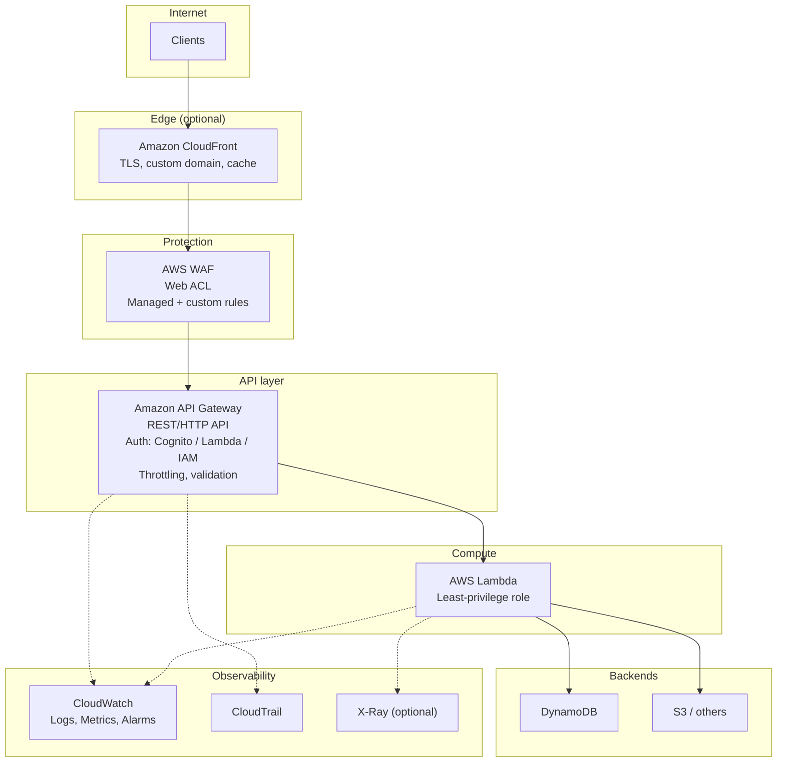

# AWS Best Practices: Securing an Internet-Facing Lambda REST API

This document outlines recommended AWS services and configuration for securing a public REST API backed by AWS Lambda, based on AWS documentation and security design principles.

---

## Recommended Services

| Service                                                | Role                                                                                                                                                         |
| ------------------------------------------------------ | ------------------------------------------------------------------------------------------------------------------------------------------------------------ |
| **Amazon API Gateway** (REST API or HTTP API)          | Single entry point; request validation; authorization (IAM, Cognito, or Lambda authorizer); throttling and rate limits; TLS for all traffic.                 |
| **AWS WAF**                                            | Web application firewall: filter/block malicious traffic (e.g. SQL injection, XSS); rules by IP, geo, headers, rate; associate a Web ACL with the API stage. |
| **AWS Shield**                                         | DDoS protection. Shield Standard is automatic for all customers; Shield Advanced optional for higher assurance and cost protection.                          |
| **Amazon CloudFront** (optional but recommended)       | In front of API: TLS termination, custom domain (ACM), caching to absorb traffic spikes; works with Shield; can reduce load on API and Lambda.               |
| **Amazon Cognito** or **Lambda authorizer** or **IAM** | Authentication and authorization. Use Cognito/JWT for end-user apps; Lambda authorizer for custom logic; IAM for AWS-to-AWS or service calls.                |
| **AWS Certificate Manager (ACM)**                      | TLS certificates for custom domain names (used by API Gateway and/or CloudFront).                                                                            |
| **Amazon CloudWatch**                                  | Logs (access + execution), metrics, alarms for throttling, errors, latency.                                                                                  |
| **AWS CloudTrail**                                     | Audit trail of API and account actions.                                                                                                                      |
| **AWS Config**                                         | Assess and monitor API Gateway resource configuration and compliance.                                                                                        |
| **AWS X-Ray** (optional)                               | Distributed tracing across API Gateway and Lambda.                                                                                                           |

---

## Best-Practice Configuration Summary

1. **Encryption in transit**  
   Use HTTPS only. Prefer TLS 1.2+; use API Gateway (and CloudFront) TLS security policies. Use ACM for custom domains.

2. **Authentication and authorization**
   - Prefer **Cognito** or **Lambda authorizer** (or IAM) so every route has a defined auth type.
   - Avoid unauthenticated routes for sensitive operations. If you must have public routes, protect them with WAF and throttling.

3. **WAF as first line of defense**
   - Associate a **Web ACL** with the API Gateway stage.
   - Use AWS managed rule groups (e.g. Core, Known Bad Inputs) and add custom rules (IP allow/block, rate, geo) as needed.

4. **Throttling and quotas**
   - Set **account-level** and **stage/method-level** throttling and quotas in API Gateway.
   - Use **usage plans and API keys** for per-client limits when appropriate.

5. **Request validation**
   - Enable **request validation** (body/query/headers) so invalid payloads are rejected before Lambda.

6. **Logging and monitoring**
   - Enable **API Gateway access logging** (e.g. to CloudWatch Logs or Firehose).
   - Enable **Lambda** logs and metrics.
   - Create **CloudWatch alarms** for 4xx/5xx, throttle, and latency.
   - Enable **CloudTrail** for API and account activity; consider **AWS Config** and **Security Hub** for posture.

7. **Least privilege**
   - Lambda execution role: only permissions needed for the workload (e.g. DynamoDB, S3).
   - IAM policies for API Gateway administration follow least privilege.

8. **Optional: CloudFront in front**
   - Put **CloudFront** in front of the API for custom domain, caching (where applicable), and to work with **Shield** and **WAF** at the edge.
   - Use **origin** = API Gateway (custom domain or invoke URL); enforce HTTPS and modern TLS at the edge.

9. **Resource tagging**
   - Tag **every resource that supports tags** with a project identifier so resources can be identified and cost-allocated. Use at least: **`Project: mnemospark`** (or `Application: mnemospark`). In CloudFormation/SAM, set tags on the stack and/or on each taggable resource (Lambda, API Gateway, DynamoDB, WAF, CloudWatch log groups, CloudFront, etc.). See [Tagging AWS resources](https://docs.aws.amazon.com/general/latest/gr/aws_tagging.html).

---

## Architecture Diagram

```
                                    ┌─────────────────────────────────────────────────────────┐
                                    │                    Internet (clients)                   │
                                    └─────────────────────────────────────────────────────────┘
                                                                    │
                                                                    ▼
┌───────────────────────────────────────────────────────────────────────────────────────────────────────────────────┐
│  Optional: Amazon CloudFront                                                                                      │
│  • Custom domain (e.g. api.example.com)                                                                           │
│  • TLS termination (ACM certificate)                                                                              │
│  • Cache (where applicable); DDoS mitigation with Shield                                                         │
│  • Origin = API Gateway custom domain                                                                             │
└───────────────────────────────────────────────────────────────────────────────────────────────────────────────────┘
                                                                    │
                                                                    ▼
┌───────────────────────────────────────────────────────────────────────────────────────────────────────────────────┐
│  AWS WAF (Web ACL attached to API Gateway stage)                                                                  │
│  • Managed rule groups (e.g. Core, Known Bad Inputs)                                                              │
│  • Custom rules: rate, IP, geo, headers                                                                           │
│  • First line of defense before API Gateway                                                                       │
└───────────────────────────────────────────────────────────────────────────────────────────────────────────────────┘
                                                                    │
                                                                    ▼
┌───────────────────────────────────────────────────────────────────────────────────────────────────────────────────┐
│  Amazon API Gateway (REST API or HTTP API)                                                                         │
│  • TLS only; request validation; throttling & quotas                                                               │
│  • Authorizer: Cognito User Pool / Lambda authorizer / IAM                                                        │
│  • Access logging → CloudWatch Logs or Firehose                                                                    │
└───────────────────────────────────────────────────────────────────────────────────────────────────────────────────┘
                                                                    │
                                                                    ▼
┌───────────────────────────────────────────────────────────────────────────────────────────────────────────────────┐
│  AWS Lambda                                                                                                        │
│  • Execution role with least-privilege permissions                                                                 │
│  • No long-lived secrets in code; use IAM, SSM, or Secrets Manager                                                  │
│  • Logs and metrics → CloudWatch                                                                                   │
└───────────────────────────────────────────────────────────────────────────────────────────────────────────────────┘
                                                                    │
                                    ┌───────────────────────────────┼───────────────────────────────┐
                                    ▼                               ▼                               ▼
                            ┌───────────────┐               ┌───────────────┐               ┌───────────────┐
                            │   DynamoDB    │               │   S3 / other  │               │  Other AWS    │
                            │   (or other   │               │   backends    │               │  services     │
                            │   data store) │               │               │               │               │
                            └───────────────┘               └───────────────┘               └───────────────┘

┌───────────────────────────────────────────────────────────────────────────────────────────────────────────────────┐
│  Observability & governance                                                                                        │
│  • CloudWatch Logs, Metrics, Alarms                                                                               │
│  • CloudTrail (API and account actions)                                                                            │
│  • AWS Config (resource compliance)                                                                               │
│  • AWS X-Ray (optional tracing)                                                                                   │
└───────────────────────────────────────────────────────────────────────────────────────────────────────────────────┘
```

---

## Mermaid Diagram (alternative)



---

## References

- [Protect your REST APIs in API Gateway](https://docs.aws.amazon.com/apigateway/latest/developerguide/rest-api-protect.html)
- [Security best practices in Amazon API Gateway](https://docs.aws.amazon.com/apigateway/latest/developerguide/security-best-practices.html)
- [Securing workloads with public endpoints (Lambda)](https://docs.aws.amazon.com/lambda/latest/dg/security-public-endpoints.html)
- [Use AWS WAF to protect your REST APIs in API Gateway](https://docs.aws.amazon.com/apigateway/latest/developerguide/apigateway-control-access-aws-waf.html)
- [Security design principles – Security Overview of Amazon API Gateway](https://docs.aws.amazon.com/whitepapers/latest/security-overview-amazon-api-gateway/security-design-principles.html)
- [Prioritize API security – Serverless Multi-Tier Architectures](https://docs.aws.amazon.com/whitepapers/latest/serverless-multi-tier-architectures-api-gateway-lambda/prioritize-api-security.html)
