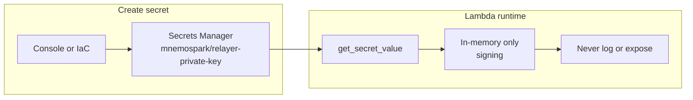

# Secrets Management: Base Wallet Relayer Private Key

This document is the single place for how mnemospark-backend stores and accesses the **Base wallet relayer private key** used for on-chain settlement. It aligns with [internet_facing_API.md](./internet_facing_API.md) (“No long-lived secrets in code; use IAM, SSM, or Secrets Manager”) and with the existing wallet KEK pattern in the object-storage example.

---

## Scope and purpose

- **In scope:** Storing and protecting **MNEMOSPARK_RELAYER_PRIVATE_KEY**—the Base wallet private key used by the relayer to submit USDC `transferWithAuthorization` transactions. This key must be protected; it must not live in environment variables, CloudFormation parameters, or application code.
- **Out of scope:** Non-sensitive configuration such as `MNEMOSPARK_BASE_RPC_URL`, settlement mode, gas limit, recipient wallet, and payment asset/network. Those remain in environment variables (or template parameters) and are not stored in Secrets Manager.

---

## Principles

1. **Relayer private key in Secrets Manager only** — Never in Lambda environment variables, CloudFormation/SAM parameters, or source code.
2. **Least privilege** — The upload Lambda’s execution role receives only the permissions required to read the relayer secret (and KMS decrypt if applicable).
3. **Audit** — Use CloudTrail for access to the secret; Secrets Manager supports versioning and optional rotation.

---

## Relayer private key (in scope)

### Secret ID convention

- **Secret ID:** `mnemospark/relayer-private-key` (or equivalent per-account convention).
- Create the secret in the AWS console or via IaC (CloudFormation/SAM or Terraform). The secret value is the raw Base wallet private key (hex string or plaintext as required by the signing library).

### Who creates it

- An operator or deployment pipeline creates the secret before or during stack deployment. The template does not create the secret value; it only references the secret (by ID or ARN) and grants the Lambda role permission to read it.

### Runtime flow

1. **Create** the secret in Secrets Manager (console or IaC).
2. **Lambda** reads the secret at cold start or first use via `boto3.client("secretsmanager").get_secret_value(SecretId="mnemospark/relayer-private-key")`.
3. **Use** the value only in memory for signing (e.g. `Account.from_key(relayer_private_key)`); never log it, include it in error messages, or expose it in responses.

### IAM

- Grant the **upload Lambda’s execution role**:
  - `secretsmanager:GetSecretValue` on the relayer secret’s ARN (or resource `arn:aws:secretsmanager:${Region}:${AccountId}:secret:mnemospark/relayer-private-key*`).
  - If the secret is encrypted with a customer-managed KMS key, also grant `kms:Decrypt` on that key.

### Security rules

- Do **not** log the private key or any substring of it.
- Do **not** include the key in error messages or API responses.
- Do **not** pass the key via environment variables or template parameters.
- Keep the key in process memory only for the duration of signing; avoid holding it longer than necessary.

---

## Non-sensitive configuration (out of scope)

The following are **not** secrets and remain in environment variables (or template parameters):

- **MNEMOSPARK_BASE_RPC_URL** — RPC endpoint URL for the Base network (e.g. public or dedicated RPC). Configuration only.
- **MNEMOSPARK_PAYMENT_SETTLEMENT_MODE** — `mock` or `onchain`.
- **MNEMOSPARK_SETTLEMENT_GAS_LIMIT** — Gas limit for the relay transaction.
- **MNEMOSPARK_RECIPIENT_WALLET**, **MNEMOSPARK_PAYMENT_ASSET**, **MNEMOSPARK_PAYMENT_NETWORK** — Public addresses and network identifiers.

They are not stored in Secrets Manager for this spec.

---

## Existing patterns

- **Wallet KEK (object-storage):** The example in `examples/object-storage-management-api` stores per-wallet KEKs in Secrets Manager under `mnemospark/wallet/<wallet_hash>`. The Lambda has IAM scoped to `mnemospark/wallet/*` for `CreateSecret` and `GetSecretValue`. The relayer private key is a separate, single secret (one per environment), not per wallet.

---

## Implementation checklist

When implementing this spec:

1. **Template (SAM/CloudFormation):**
   - Remove `MNEMOSPARK_RELAYER_PRIVATE_KEY` from the upload Lambda’s `Environment.Variables` (and remove `!Ref RelayerPrivateKey` or equivalent parameter from the template).
   - Add a policy to the upload Lambda’s execution role: `secretsmanager:GetSecretValue` on the relayer secret ARN (and `kms:Decrypt` if using a customer-managed KMS key).
   - Pass the secret identifier to the Lambda via an env var that does **not** contain the key value, e.g. `MNEMOSPARK_RELAYER_SECRET_ID=mnemospark/relayer-private-key` (or the secret ARN).

2. **Lambda code (storage-upload):**
   - When `MNEMOSPARK_PAYMENT_SETTLEMENT_MODE=onchain`, resolve the relayer private key by calling `boto3.client("secretsmanager").get_secret_value(SecretId=os.environ["MNEMOSPARK_RELAYER_SECRET_ID"])` (or equivalent). Use the returned value only in memory for signing; do not log or expose it.
   - Remove any read of `MNEMOSPARK_RELAYER_PRIVATE_KEY` from `os.environ`.

3. **Secret creation:** Ensure the secret exists before deployment (console or IaC). Optionally document or provide a minimal CloudFormation/SAM snippet for creating the secret resource (without the value, which is set separately).

---

## Diagram

---

## References

- [internet_facing_API.md](./internet_facing_API.md) — Lambda: “No long-lived secrets in code; use IAM, SSM, or Secrets Manager.”
- [AWS Secrets Manager – Rotate, manage, and retrieve secrets](https://docs.aws.amazon.com/secretsmanager/latest/userguide/intro.html)
- [Retrieve a secret (AWS SDK for Python)](https://docs.aws.amazon.com/secretsmanager/latest/userguide/retrieving-secrets_python.html)
